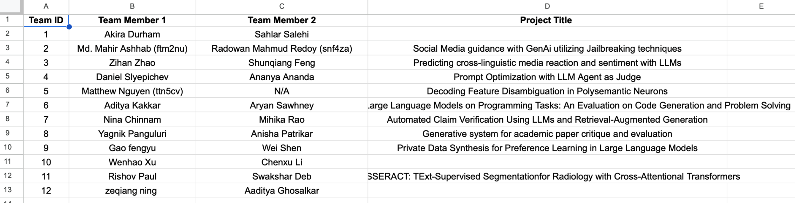
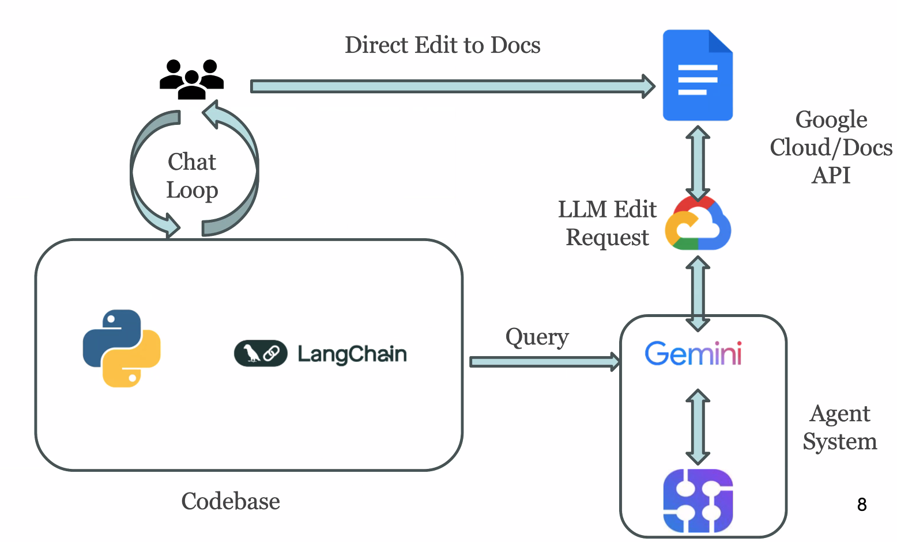
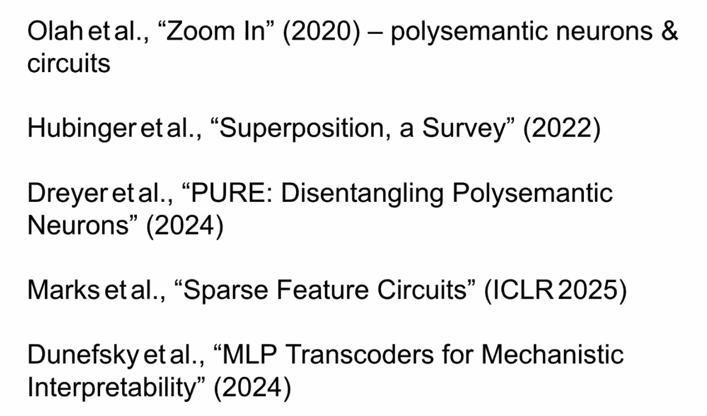
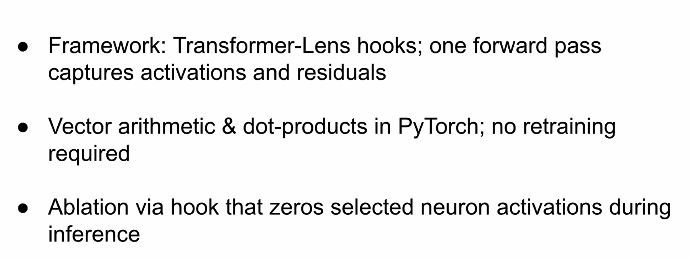
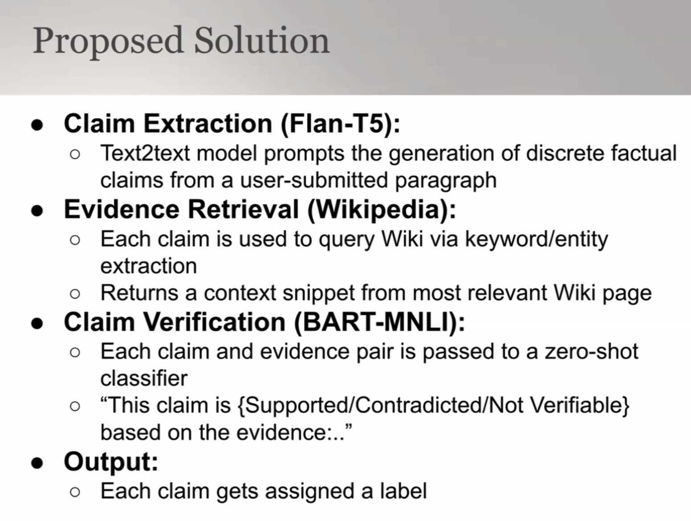
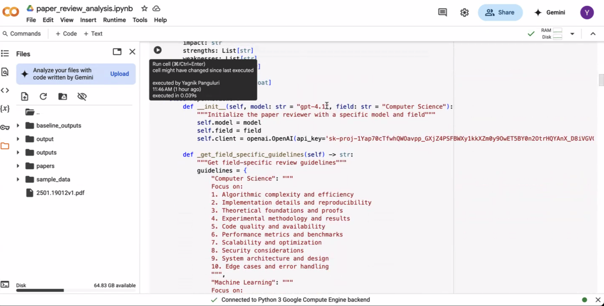
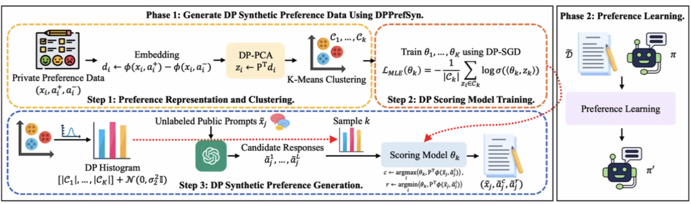
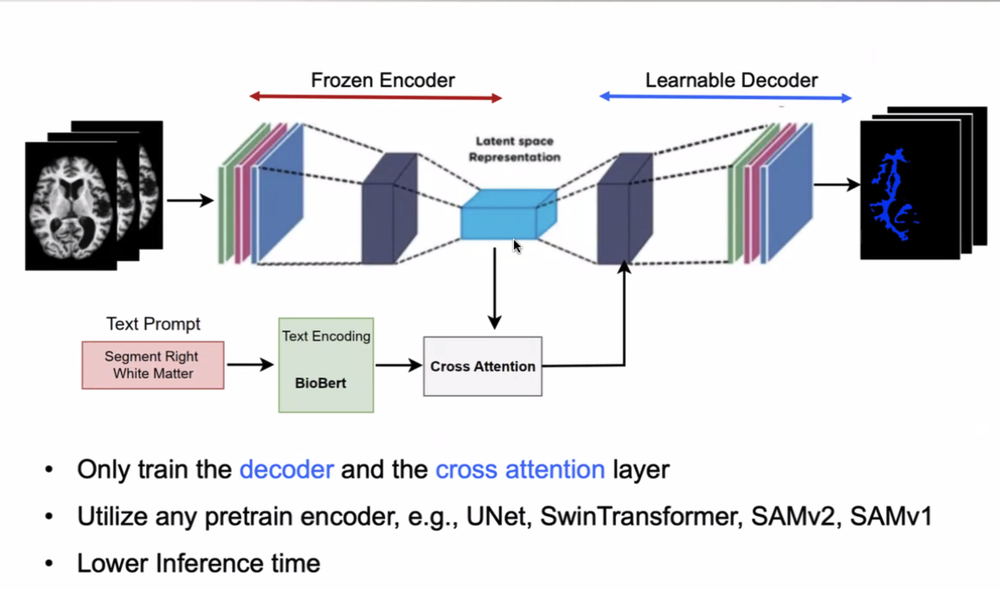

# Students' Final Projects for 2025 Spring-UVA-CS 5764 Applied NLP/GenAI

+ Students’ Final Projects for 2025 Spring-UVA-CS GenAI Foundation and Application Overviews

+ Course Web: [https://qiyanjun.github.io/2025sp-GenAI-overview/](https://qiyanjun.github.io/2025sp-GenAI-overview/)

+ This Project Github: [https://github.com/Qdata4Capstone/uva-25-spring-genai-students-projects](https://github.com/Qdata4Capstone/uva-25-spring-genai-students-projects)

## Index 

## Team 1: 

## Team-2

## Team 5

## Team 7

## Team 8

## Team-9

## Team 11

